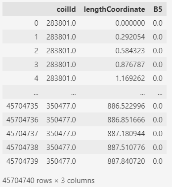
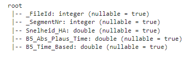
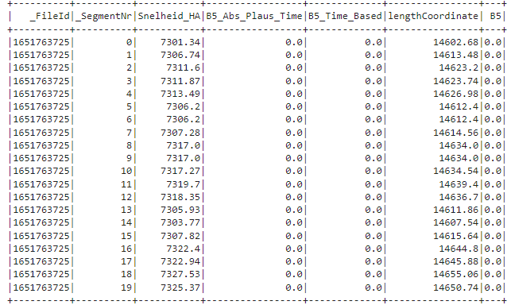

# ArcelorMittal Project

This project is about preprocessing row data with pandas and pyspark, then create database with sqlite3
- ***Dataset:*** ==B3_B4.txt==;  ==B5.txt==; ==CoilDataInput.xlsx==
- ***Description:*** Convert ==*txt*== file to ==*csv*== file, ==*xlsx*== to ==csv==


### Prerequisites

Requirements for the software and other tools in order to run the whole programe
- [Python 3.9](https://www.python.org/downloads/)
- [Pandas](https://pandas.pydata.org/docs/getting_started/install.html)
- [Pyspark](https://spark.apache.org/docs/latest/api/python/getting_started/install.html)
- [Java](https://www.oracle.com/java/technologies/downloads/)
- [Sqlite3](https://www.sqlite.org/download.html)

### Installing

You should have `python` `java`installed in your local machine before install others

by install pandas, you could run this command in your CMD

    pip install pandas

same for the `pyspark` and `sqlite`

    pip install pyspark
    pip install sqlite


## [Data Preprocessing (Pandas)](clean-row-data/B345_seperated_csv_preprocessing_pandas.ipynb)

The data we get from client was totally raw data in the text file, which we cannot directly use, so we convert `txt` file to `csv` first using pandas

```python
    read_file = pd.read_csv (r'File name.txt')
    read_file.to_csv (r'File name.csv', index=None)
```
Since we need **lengthCoordinate** for the model, we use this formular to get lengthCoordinate
>  $$ lenthCoordinate = previouse lengthCoordinate +  previous_sh * 0.001 * 0.04$$


As **B3,4,5** value is also required, we use another formula to get **B3,4,5** values
> $$ B345Value = B345TimeBased * 0.1  $$

Till now we have most of information we need for model, the last step is using `pandas` to join ==referenceB3_4== and ==referenceB5== data which including ***coilId***

In the end, Use `pandas` to drop unnecessary columns, split dataframe B3_4 in to B3 and B4 two dataframe

Write B3, B4, B5 to csv file
```python
    df5.to_csv('B5.csv', index=True)
```
It is also possible to write to Database directly from pandas dataframe, but the priority is the database has already been built
```python
    for row in df5.itertuples():
        cursor.execute('''
            INSERT INTO Table_B5(_FileId, lengthCoordinate, B5)
            VALUES(?,?,?)
            ''', row)
    connexion.commit() 
```


## [Data Preprocessing (Pyspark)](clean-row-data/B345_seperated_csv_preprocessing_spark.ipynb)
Alternatively, using Pyspark to run whole processe
first import all of necessary libraries
```python
    import pyspark
    from pyspark.sql import  SparkSession
    from pyspark.sql.types import IntegerType, FloatType, StringType
    from pyspark.sql.functions import col
    from pyspark.sql.functions import lit
```
The entry point into all of functionality in Spark is the `SparkSession`, for python to create a basic SparkSession, can just `from pyspark.sql import  SparkSession` 
the sytax for `pyspark` is similar to `pandas`
==for example:==

```python
    #read csv
    df = spark.read.csv('filename.csv', header=True, inferSchema=True)

    #print schema
    df.printSchema()
```

Using [UDF](https://spark.apache.org/docs/3.1.3/api/python/reference/api/pyspark.sql.functions.udf.html) function from spark to run the fomula to get the `lengthCoordinate` and `values`

After having dataframe ready, with pyspark it is possible to direct send dataframe to `database.db` once you create it
```python
    url = "jdbc:sqlite:Database.db"
    coilData_pyspark2.write.jdbc(url=url, driver='org.sqlite.JDBC', table='B5')
```
It is also possible to write to csv file first then, `INSERT INTO` database with SQL quries
```python
    df_b5.write.csv('B5', header=True, index=True)
```

## [Create Database](database/database.ipynb)
For this project, we use [sqlite3](https://docs.python.org/3/library/sqlite3.html#tutorial) to build database
Import necessary libraries is always the very first step
```python
    import sqlite3
```

First, we need to create a new **database** and open a database **connection** to allow `sqlite3` to work with it. Call `sqlite3.connect()` to to create a connection to the database `database.db` in the current working directory, implicitly creating it if it does not exist:, in order to excute the SQL statement and fetch result from SQL queries, we will need to use a database `cursor` as well
```python
    connexion = sqlite3.connect("Database.db")
    cursor = connexion.cursor()
```
After create the database, and connect to the database as well, we create ==table B3, B4, B5 and coilDataInput==
```python
    cursor.execute('''
        CREATE TABLE IF NOT EXISTS B3_table
        (index INTEGER PRIMARY KEY ,
        coilId INTEGER
        lengthCoordinate FLOAT,
        B3 FLOAT)
    ''')
    print("table1 created")
    connexion.commit()
```
Once we create table, we INTER INTO csv files we write to from cleaned dataframe with SQL quries
```python
    file = open('B5.csv', 'r')
    reader_B5 = csv.reader(file)
    for row in reader_B5:
        cursor.execute('''
            INSERT INTO Table_B5(_FileId, lengthCoordinate, B5)
            VALUES(?,?,?)
            ''', row)
    connexion.commit()
```


## [Example Queries & Database Schema](Example_Queries/Example_Queries.ipynb)

In this file, we provided some example queries for ml engineer to use, for example `JOIN` and `SELECT`


