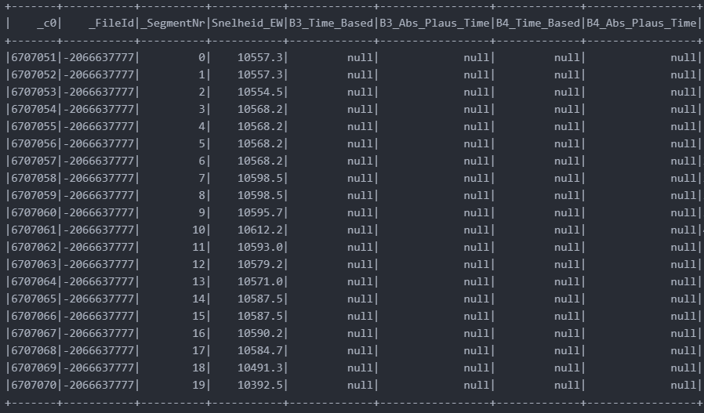
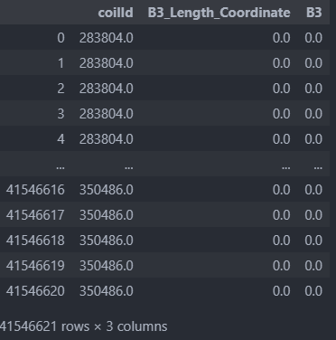

# ArcelorMittal Project

This project is about preprocessing row data with pandas and pyspark, then create database with sqlite3
- ***Dataset:*** 
    - B3_B4.txt  
    - B5.txt 
    - CoilDataInput.xlsx
- ***Description:*** Convert *txt* file to *csv* file, *xlsx* to csv


### Prerequisites

Requirements for the software and other tools in order to run the whole programe
- [Python 3.9](https://www.python.org/downloads/)
- [Pyspark](https://spark.apache.org/docs/latest/api/python/getting_started/install.html)
- [Sqlite3](https://www.sqlite.org/download.html)

### Installing

You should have `python` `java`installed in your local machine before install others

by install pandas, you could run this command in your CMD

    pip install pandas

same for the `pyspark` and `sqlite`

    pip install pyspark
    pip install sqlite


## [Formula](RawData_Processing/RawData_Processing_B3B4.ipynb)

The data we get from client was totally raw data in the text file, and missing lengthCoordinate and B345_values which is necessery for the models, so here we use two formula base on information we already have from raw data

> **lengthCoordinate**
> $$ lenthCoordinate = previouse lengthCoordinate +  currentSneilheid * 0.001 * 0.04$$

> **B3,4,5**
> $$ B345Value = B345TimeBased * 0.1  $$

Then we have python [function](RawData_Processing/RawData_Processing_B3B4.ipynb) to use this formula to calculate ***lengthCoordinate*** and ***B345***


## [Data Preprocessing (Pandas)](clean-row-data/B345_seperated_csv_preprocessing_pandas.ipynb)
Using pandas to work on some preprecessing on the data
first step we read the csv file from row data, with formula function, we've have length and values, so at this point, we joined B34_coilId, drop columns that is not nessasery, which is also important for the model
```python
    df = pd.merge(df, df_coilId, on='_FileId')
```

To save ready dataframe, we write to database directly through pandas

## [Data Preprocessing (Pyspark)](clean-row-data/B345_seperated_csv_preprocessing_spark.ipynb)
Alternatively using Pyspark to run whole processe
first import all of necessary libraries
```python
    import pyspark
    from pyspark.sql import  SparkSession
    from pyspark.sql.types import IntegerType, FloatType, StringType
    from pyspark.sql.functions import col
    from pyspark.sql.functions import lit
```
The entry point into all of functionality in Spark is the `SparkSession`, for python to create a basic SparkSession, can just `from pyspark.sql import  SparkSession` 
the sytax for `pyspark` is similar to `pandas`
==for example:==

```python
    #read csv
    df = spark.read.csv('filename.csv', header=True, inferSchema=True)

    #print schema
    df.printSchema()
```


Using **fomula** to get the `lengthCoordinate` and `values`


As we see, the B3_4 are in the same dataframe, so we now need to split dataframe into B3 and B4, which we drop the column we dont need for each
```python
    df_B3 = df.drop('B4')
```

**CoilId** is also important for the model, so we joined coilInput file with B34 dataframe, rename the ***Rolnummer*** to ***coilId***
```python
    df_b34 = df_B34.join(df_coil, df_B34._FileId == df_coil_b3._FileId, how='right')
```

After having dataframe ready, with pyspark it is possible to direct send dataframe to `database.db` once you create it
```python
    url = "jdbc:sqlite:Database.db"
    coilData_pyspark2.write.jdbc(url=url, driver='org.sqlite.JDBC', table='B5')
```
It is also possible to write to csv file first then, `INSERT INTO` database with SQL quries
```python
    df_b5.write.csv('B5', header=True, index=True)
```

## [Create Database](database/database.ipynb)
For this project, we use [sqlite3](https://docs.python.org/3/library/sqlite3.html#tutorial) to build database
Import necessary libraries is always the very first step
```python
    import sqlite3
```

First, we need to create a new **database** and open a database **connection** to allow `sqlite3` to work with it. Call `sqlite3.connect()` to to create a connection to the database `database.db` in the current working directory, implicitly creating it if it does not exist:, in order to excute the SQL statement and fetch result from SQL queries, we will need to use a database `cursor` as well
```python
    connexion = sqlite3.connect("Database.db")
    cursor = connexion.cursor()
```
After create the database, and connect to the database as well, we create ==table B3, B4, B5 and coilDataInput==
```python
    cursor.execute('''
        CREATE TABLE IF NOT EXISTS B3_table
        (index INTEGER PRIMARY KEY ,
        coilId INTEGER
        lengthCoordinate FLOAT,
        B3 FLOAT)
    ''')
    print("table1 created")
    connexion.commit()
```
Once we create table, we INTER INTO csv files we write to from cleaned dataframe with SQL quries
```python
    file = open('B5.csv', 'r')
    reader_B5 = csv.reader(file)
    for row in reader_B5:
        cursor.execute('''
            INSERT INTO Table_B5(_FileId, lengthCoordinate, B5)
            VALUES(?,?,?)
            ''', row)
    connexion.commit()
```


## [Example Queries & Database Schema](Example_Queries/Example_Queries.ipynb)

In this file, we provided some example queries for ml engineer to use, 
==for example:==
```python
    query2 = """
        SELECT *
        FROM B4_table
        WHERE coilId = 290491
        LIMIT 10
        """
    seg = 0
    for row in cursor.execute(query2):
            print (f"length-coordinate for segment {seg} = {row[1]}")
            seg = seg + 1
```
```python
    query3 = """ 
        SELECT distinct coilId
        FROM B5_table
        LIMIT 20
        """

    for item in cursor.execute(query3):
        print(f"coilId: {item[0]}")
```


